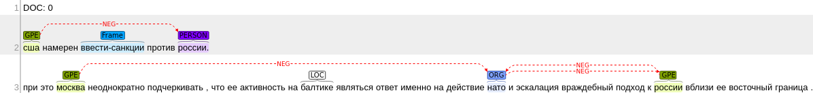
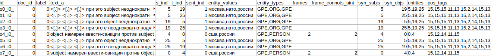

# ARElight 0.22.0

This is a DEMO project of sentiment relations annotation, 
commonly powered by [AREkit](https://github.com/nicolay-r/AREkit) framework.

<p align="center">
    
</p>


## Dependencies

* arekit == 0.22.0
* gensim == 3.2.0
* deeppavlov == 1.11.0
* rusenttokenize
* brat-v1.3 [[github]](https://github.com/nlplab/brat)

We adopt [DeepPavlov](https://github.com/deepmipt/DeepPavlov) 
for Named Entity Recognition in text sentences (BertOntoNotes model).

# Installation

* ARElight:
```bash
# Install the required dependencies
pip install -r dependencies.txt
# Donwload Required Resources
python3.6 download.py
```

* BRAT: [Download](https://github.com/nlplab/brat/releases/tag/v1.3_Crunchy_Frog) 
  and install library, and run standalone server as follows:
```
./install.sh -u
python standalone.py
```

# Inference

<p align="center">
    
</p>

> Figure: Named Entities annotation and sentiment attitudes between mentioned named entities for a given [Mass-Media document example](data/texts-inosmi-rus/e0.txt).

In order to infer sentiment attitudes from a mass-media document, 

For the `BERT` (NOTE: pretrained version by default has not been fine-tuned):
```bash
python3.6 run_infer_bert.py --from-file data/texts-inosmi-rus/e1.txt
```
For the pretrained `PCNN` model:
```bash
python3.6 run_infer_nn.py --from-file data/texts-inosmi-rus/e1.txt \
    --model-name pcnn \
    --model-state-dir models/ \
    --terms-per-context 50 \
    --stemmer mystem \
    --entities-parser bert-ontonotes \
    --frames ruattitudes-20 \
    --labels-count 3 \
    --bags-per-minibatch 2 \
    --model-input-type ctx \
    --entity-fmt hidden-simple-eng \
    --emb-filepath data/news_mystem_skipgram_1000_20_2015.bin.gz \
    --synonyms-filepath data/synonyms.txt \
    -o output/brat_inference_output
```

# Serialization 

<p align="center">
    
</p>

> Figure: The result of samples that might be utilized for ML training in further for a given [Mass-Media document example](data/texts-inosmi-rus/e0.txt).

In order to infer sentiment attitudes, use the `run_serialize.py` script as follows.

For the `BERT` model:
```bash
python3.6 run_serialize_bert.py --from-file data/texts-inosmi-rus/e1.txt \
```

For the other neural networks (including embedding and other features):
```bash
python3.6 run_serialize_nn.py --from-file data/texts-inosmi-rus/e1.txt \
    --entities-parser bert-ontonotes \
    --stemmer mystem \
    --terms-per-context 50 \
    --emb-filepath data/news_mystem_skipgram_1000_20_2015.bin.gz \
    --synonyms-filepath data/synonyms.txt \
    --frames ruattitudes-20 
```

# Training other models

[Proceed with the Tutorial](README_train_custom_model.md)

# Powered by

* AREkit [[github]](https://github.com/nicolay-r/AREkit)
* DeepPavlov [[github]](https://github.com/deepmipt/DeepPavlov)

<p float="left">
<a href="https://github.com/nicolay-r/AREkit"></a>
<a href="https://github.com/deepmipt/DeepPavlov"></a>
</p>
